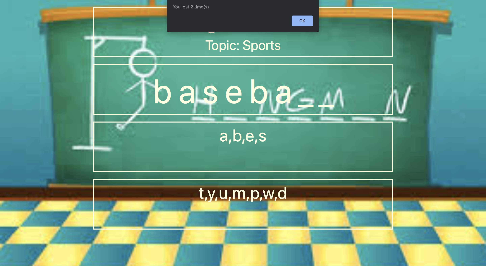

### Hangman

This is a sports edition Hangman Game written in Vanills JS. Keeps track of the usual, such as, correct & incorrect
guesses. Also advises the users how many times he/she has won or lost. 

### Start of the game: 

### Winning game: 

### Losing game: 

### Let's connect 
[LinkedIn](https://www.linkedin.com/in/jamal-numan/)
